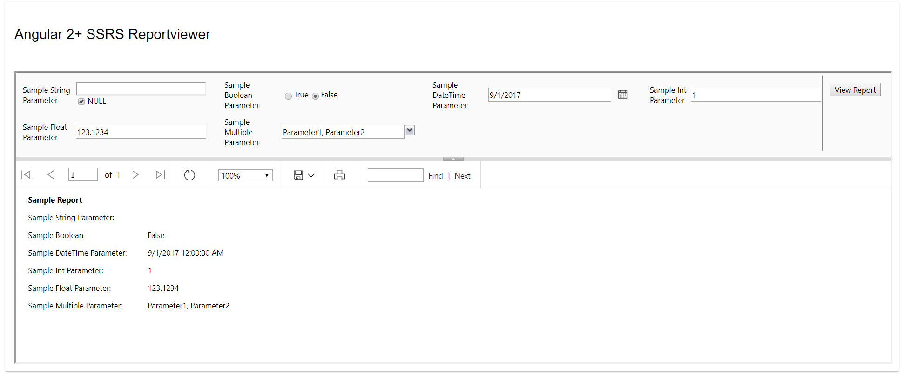
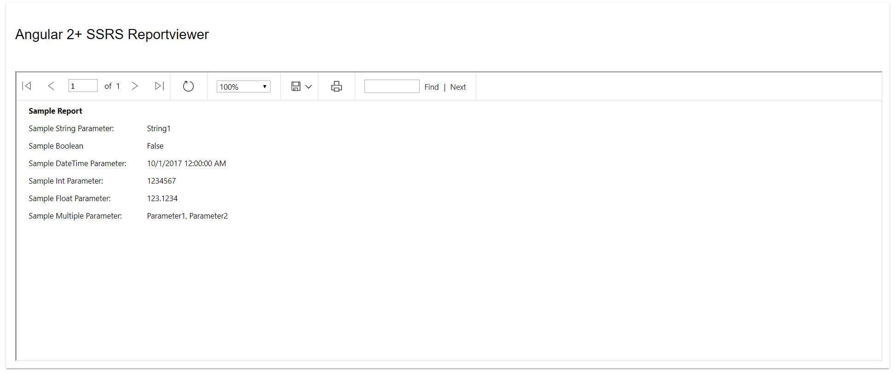
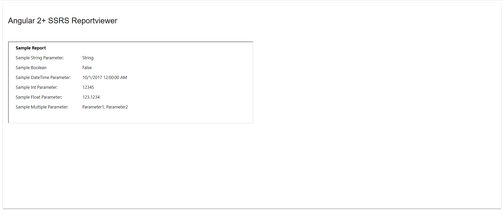

Angular 2+ SQL Server Report Viewer (ngx-ssrs-reportviewer)
===================

This library was created to give users the ability to display SQL Server Reporting Services (SSRS) reports within Angular applications.  The report viewer simplifies the process of sending commands to your report server through URL requests.  For example, you can pass parameter values and modify the controls that the user has access to inside the report viewer through your own Angular components.  You can read more about using URL access of the report server [here](https://docs.microsoft.com/en-us/sql/reporting-services/url-access-ssrs).

## Usage


1. Install ngx-ssrs-reportviewer using npm:

    ``` npm install ngx-ssrs-reportviewer --save ```

2. Add SSRSReportViewerModule into your AppModule class. An example `app.module.ts` would look like this:

```javascript
    
import { BrowserModule } from '@angular/platform-browser';
import { NgModule } from '@angular/core';
import { AppComponent } from './app.component';
import { SSRSReportViewerModule } from 'ngx-ssrs-reportviewer';

@NgModule({
  declarations: [
    AppComponent
  ],
  imports: [
    BrowserModule,
    SSRSReportViewerModule
  ],
  providers: [],
  bootstrap: [AppComponent]
})
export class AppModule { }

```

3. Add the report viewer to your components html template. An example `app.component.html` with all the report viewer attributes would look like this: 

```html
    <div class="container">
        <ssrs-reportviewer
            [reportserver]="reportServer"
            [reporturl]="reportUrl"
            [showparameters]="showParameters" 
            [parameters]="parameters" 
            [language]="language" 
            [width] ="width" 
            [height]="height" 
            [toolbar]="toolbar" >
        </ssrs-reportviewer>
    </div>
```
NOTE: Many of these attributes are optional. I will cover which attributes are required below and what each one does.

4. Now inside your component you can initialize the report viewers attributes. Initialization of all the attributes inside `app.component.ts` would look like this:

```typescript
import { Component } from '@angular/core';

@Component({
  selector: 'my-app',
  templateUrl: './app.component.html',
  styleUrls: ['./app.component.css']
})
export class AppComponent {
 
  reportServer: string = 'http://myreportserver/reportserver';
  reportUrl: string = 'MyReports/SampleReport';
  showParameters: string = "true"; 
  parameters: any = {
   "SampleStringParameter": null,
   "SampleBooleanParameter" : false,
   "SampleDateTimeParameter" : "9/1/2017",
   "SampleIntParameter" : 1,
   "SampleFloatParameter" : "123.1234",
   "SampleMultipleStringParameter": ["Parameter1", "Parameter2"]
   };
  language: string = "en-us";
  width: number = 100;
  height: number = 100;
  toolbar: string = "true";
}
```

## Attributes

| Name          | Description   | Options | Required |
| ------------- |-------------| -----:|-----:|
| reportserver  | The *rswebserviceurl* of your report server.  The default of most configurations looks like http://myreportserver/reportserver | N/A | Yes |
| reporturl      | The *pathinfo* of your report.  This is the relative name of the report in your report server.       |   N/A | Yes |
| showparameters | Controls the display of parameters.      |  true, false, collapsed   | No |
| toolbar | Controls the display of the report viewer toolbar.  |  true, false   | No |
| parameters | The report parameters you are passing to the report.     |  N/A   | No |
| language | The lanuage of culture-sensitive report parameters such as dates, times or currency.     |  [Lanuage Codes](https://msdn.microsoft.com/en-us/library/ms533052(v=vs.85).aspx)  | No |
| width | The width of the viewer relative to its container.  Default is 100.  | 1-100  | No |
| height | The height of the viewer relative to its container.  Default is 100.  | 1-100  | No |

## Limitations
There are some limitations with the report viewer component that should be noted. 

1. Authentication.
 Depending on the authentication you use in your application you may run into problems with permissions.  SQL Server Reporting Services uses Windows Authentication to determine access to the reports.  If you are working in a .NET/.NET Core environment you can enable Windows Authentication in your app and the users credentials will be passed to the report server.  You could also configure your application to use Impersonation to pass the necessary credentials to your report.  How you handle these limitations will depend on your own environment.  Currently you cannot securely pass credentials to the report server with URL access.

 2. Preventing Mixed Content
  The report viewer uses iframes so if your reportserver is HTTP and you are trying to render it in an HTTPS application you will run into issues.

## Simple Examples
Here are some simple examples of the report viewer.

showparameters set to "true"


showparameters set to "false"


toolbar set to "false" with a width and height of 50
